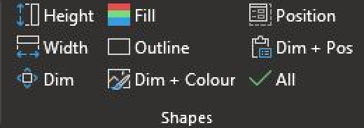
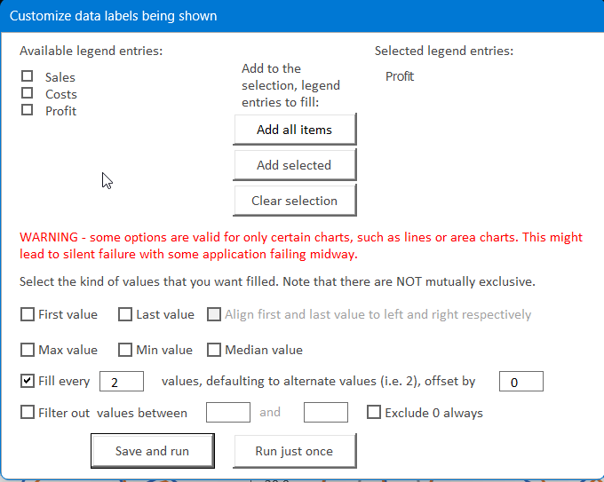
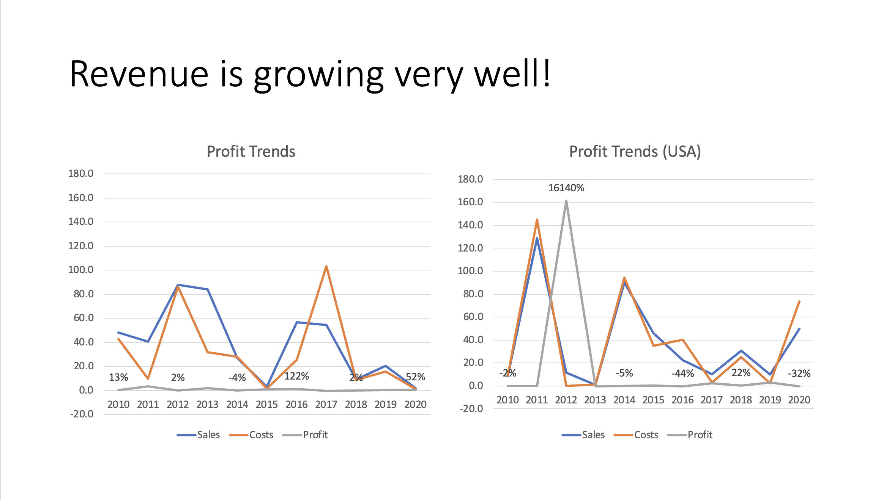
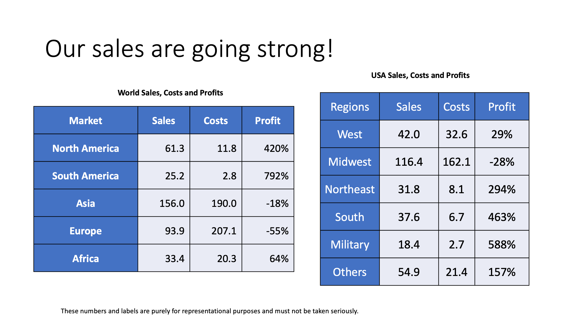
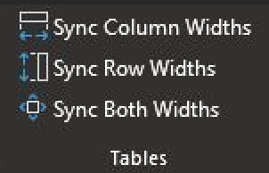
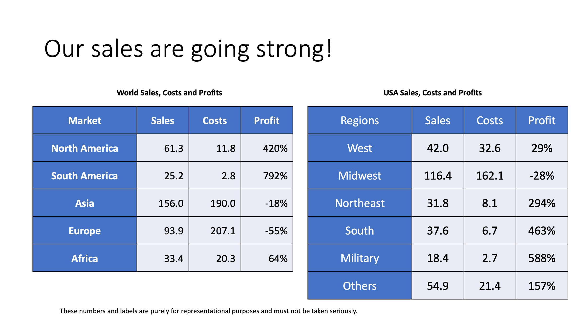

# Premise

When I worked in healthcare consulting, I often spent a LOT of my time creating PowerPoint presentations (*decks* in consulting lingo - not even *slide decks*). However, it was rather repetitive. Thus, was born PowerPointSnap.

# What is it?

I'll write this down as pointers.

1. It's a VBA based PowerPoint add-on. Just a set of commands that work well with each other.
2. It's Windows only - it's unlikely to work on MacOS.
3. It's installation-free and is not an executable, which makes it perfect for locked-down corporate environments, as long as you have the permission to download files.

# How do I get it?

The project is available on this [Github repo](https://github.com/avimallu/PowerPointSnap). The instructions to install it are available there, but here's the down-low:

1. Download the Snap.ppam file to your system.
2. Enable the developer options.
3. Go to the Developer tab, and click on PowerPoint Add-ins.
4. Click on Add New. Choose the location of the file you just dowloaded. Click Close.
5. To uninstall, repeat the process, and simply click on Remove this time.

# What can I do with it?

Frankly, a LOT. The base concept of this tool is:

1. "Set" a shape as the one you want to copy a property from.
2. Select any property from the list to automatically apply it.

Here's a non-exhaustive list of all the options available.

## Apply properties of shapes directly

This is the part of the interface that can be used for shapes (which include charts and tables).

To use, first select a *shape* object, click on "Set". Then, choose the object you want to *Snap* its properties to (see how I got the inspiration for the name?). You should be able to copy all compatible properties - if something is not copy-able, the tool will show an error, and then let you exit.

Note that it's probably not to apply a property of a shape to a table - if you want to make the entire table orange, there are probably better built-in ways to do it than to use *Snap*.

## Beautify charts with *Snap*pable properties

Charts are also supported, with dedicated features for it.

What do these features do? You should be able to hover over the option and get a tooltip that shows what it's capable of, but here's another summary just in case:

1. Sync Value/Date Axis: this will try to align the range, the ticks, the numeric values etc. of the "set" chart to the one you've selected. I couldn't put in just $x$ and $y$ here because Microsoft internally doesn't label them that way. Try either of these two options (you can undo!) and see what works best for your chart. This doesn't work well yet for 3D charts.
2. Sync Plot/Title/Legend: often, you want to centre a title, or make sure that multiple charts that show nearly identical things for different variables all *look* exactly the same from a client perspective. But that's usually difficult if you've already configured the charts a little - which can be remedied with this option!
3. Format Painter: this is simply a helper for the normal format painter to align the formats of the text that you've selected with the way it originally is in the "set" chart. The reason for this feature is simply to avoid going back to *Home* to click on the *Format Painter* option again.
4. Reset Axes Scales: in case you messed up somewhere, you can use this to rever to PowerPoint defaults.

The next two options deserve their own section.

## Customize the labels programmatically

Your immediate senior in a consulting environment would frown at your chart, and then exclaim, "I think that's too many labels for the data points. Can you show them every two/three/four labels? I know this is manual work, but it's a one time thing!"

It's **never** a one time affair. But don't worry, we have this nice feature to help us. If you click on the *Customize Label* option, you will get this (without the "Set" option):

Never mind the rather unfriendly legend entries. They're just here to demonstrate that you can do the following kinds of whacky abilities with your own chart!

### Screenshots of the chart *snap*ability

Of course, visuals will do it more justice. For example, look at this image:

Here's what you can do:

1. Click on the left chart. Press "Set" in the toolbar for *Snap*.
2. Click on the right chart, and then go through the following:
	1. In *Shapes*, click on *Dim*. This will align the shapes of the chart.
	2. Use the guides that you get while moving the chart to align the positions of the two charts now that their shapes are equal.
	3. You'll notice that the chart area doesn't still match, nor does the title.
	4. In *Charts*, click on *Sync Plot Area* and *Sync Title Area*, and watch the magic unfold.
	5. Now, click on the second chart, and click on "Set". Let's align the axes of the first chart to the second one.
	6. Click on the first chart, and then in *Charts*, click *Sync Value Axis*.
3. Let's bring that senior's exclamation back into play - (s)he wants you to highlight *only* Profit labels, and that too every 2 iterations. To do this:
	1. Click on *Customize Labels* after clicking on either chart.
	2. You'll get the screen shown in the previous section. Make sure to adjust the values such that it's exactly like the screenshot there.
	3. Click on "Save and Run". This will *save* the configuration you've selected, and *run* it on the chart you've selected.
	4. Click the other chart. Then, in *Charts*, click on *Rerun Customization*.

This is what your results should look like:

Of course, getting those calculations right is a whole different thing that will need some work.

## Align table dimensions

Oftentimes, you have two tables that show similar values... you know the drill. Here's what you can do in a scenario such as this:

This is what the *Tables* section of the tool looks like:

To align these tables together,

1. Click on the left table. Press "Set" in the toolbar for *Snap*.
2. Click on the right table.
3. Click on *Shapes*, inside it, *Dim*. Now the shapes of the table are the same.
4. In *Tables*, click on *Sync Column Widths*. Now the columns are also the same.
5. If you try to align by rows, it fails because the number of rows are not the same in the two tables.

Here's what you'll end up with:

Pretty neat, eh?

